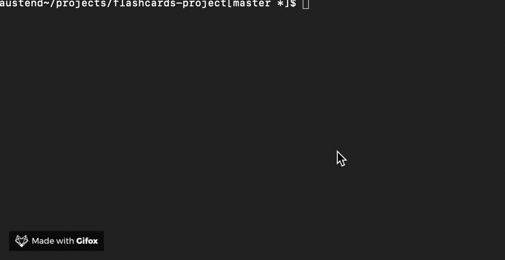

# FlashCards
Step right up! Flashcards will test your knowledge of javascript array prototype methods via a multiple choice game playable from the command line.

---
## Flashcards in Action!

---
## Setup
1) Clone down the flashcards-project repository
2) Navigate to its root directory locally via the command line
3) Enter - node index.js
4) Play the quiz game!
